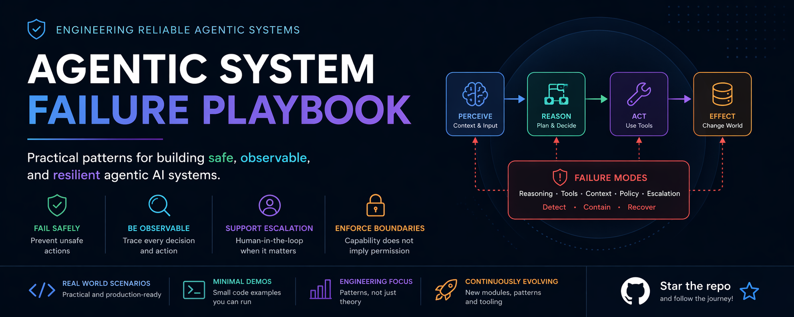

# Agentic System Failure Playbook 🛡️



A comprehensive guide and collection of engineering patterns for building **reliable, observable, and safe** agentic AI systems.

---

## 🚀 Overview

Most agentic AI discussions focus on capability—what an agent *can* do. In production, however, the real challenge is **failure**. This playbook provides practical, code-first examples of how agentic systems fail and how to build systems that contain, detect, and recover from those failures.

### Core Principles
- **Capability ≠ Permission**: Actions must be validated by independent policy engines.
- **Fail Safely**: Systems should degrade gracefully and support human-in-the-loop escalation.
- **Observability**: Every decision trace must be logged and auditable.
- **Reversibility**: Design for compensating transactions and rollback workflows.
- **Resilience**: Bounded autonomy with circuit breakers and failure budgets.

---

## 🏗️ Defense-in-Depth Architecture

This playbook is organized into four progressive layers of safety engineering:

1. **Failure Taxonomy**: Identifying and blocking known failure modes.
2. **Reversible Autonomy**: Ensuring every action can be undone or compensated.
3. **Decision Traceability**: High-fidelity auditing of the reasoning process.
4. **Resilience Engineering**: Chaos-testing and circuit-breaking for stable operations.

---

## 📦 Repository Structure

- [**failure_taxonomy/**](failure_taxonomy/)  
  Understand failure modes across reasoning, tool usage, and context drift. Includes a minimal agent simulation with policy enforcement.
- [**reversible_autonomy/**](reversible_autonomy/)  
  Design patterns for safe execution and automated rollback of autonomous actions. Includes an action journal and compensating transaction demo.
- [**decision_traceability/**](decision_traceability/)  
  High-fidelity decision logs and reasoning traces for forensic auditing and observability. Includes a dedicated Decision Trace Engine.
- [**resilience_testing/**](resilience_testing/)  
  Chaos engineering and resilience patterns for AI agents, including circuit breakers and failure budgets.

---

## ▶️ Getting Started

Each module includes its own simulator. You can run them individually:

### 1. Failure Taxonomy
```bash
python failure_taxonomy/simulator.py
```

### 2. Reversible Autonomy
```bash
python reversible_autonomy/simulator.py
```

### 3. Decision Traceability
```bash
python decision_traceability/simulator.py
```

### 4. Resilience Engineering
```bash
python resilience_testing/simulator.py
```

---

## 🤝 Contributing

We welcome contributions of real-world failure scenarios, containment patterns, and research on agent safety.

---

## ⭐ Support

If you find this playbook useful, please star the repository!

---

*This repository accompanies the Medium series: **"Failure Modes of Agentic Systems — An Engineering Playbook"***
