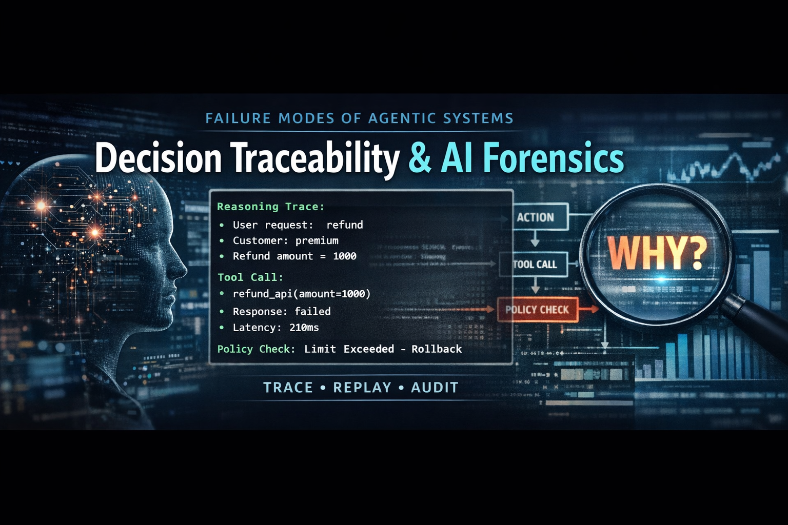

# Decision Traceability & AI Forensics



Understanding why an agent made a decision — not just what happened.

---

## 🚀 Why This Module Exists

In production systems:

**200 OK does not mean success.**

The API may succeed while the business decision fails.

This module demonstrates how to create:
- **Reasoning Traces**: Capturing context and intent.
- **Tool Traces**: Logging inputs, outputs, and latency.
- **Policy Traces**: Documenting safety boundary results.
- **Governance Traces**: Recording ownership and escalation.

Decisions can be replayed, audited, and debugged with forensic precision.

---

## 🧠 Core Principle

> If you cannot replay the decision, you cannot trust the autonomy.

---

## 🔄 What This Demo Shows

The `simulator.py` script walks through a multi-stage decision trace:
1. **Agent Request**: Initiating the task.
2. **Reasoning Captured**: Logging the chain-of-thought.
3. **Tool Execution Logged**: Tracking external interactions.
4. **Policy Evaluated**: Enforcing safety constraints.
5. **Governance Ownership Recorded**: Assigning responsibility.
6. **Final Action Stored**: Persisting the ultimate outcome.

---

## ▶️ Run the Demo

```bash
python simulator.py
```

---

*This module is part of the **Agentic System Failure Playbook**. For foundational concepts, see the [failure_taxonomy](../failure_taxonomy/) module, and for state recovery patterns, see the [reversible_autonomy](../reversible_autonomy/) module.*
