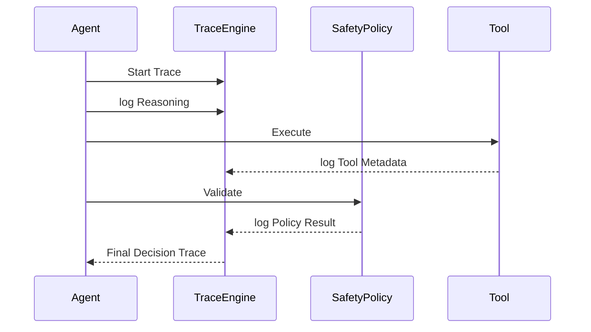

# Decision Traceability 🔍


High-fidelity observability and auditable decision traces for autonomous agentic systems.

---

## 🚀 Why This Module Exists

In a traditional system, debugging is a matter of following code paths. In an agentic system, debugging is a matter of following **reasoning paths**. 

When an agent fails—or takes a risky action—knowing *what* happened is not enough. You must know **why** the decision was made, what tools were used, and which policies were applied. This module implements a **Decision Trace Engine** that provides a forensic audit trail of agentic behavior.

### Key Objectives
- **Reasoning Transparency**: Capture the chain-of-thought leading to an action.
- **Tool Observability**: Log precision data for every external API or tool interaction.
- **Policy Attribution**: Record which version of which safety policy authorized the action.
- **Governance Chains**: Track ownership and automated escalation paths for every decision.

---

## 🧠 The Decision Trace Engine

The core of this module is the `DecisionTrace` engine, which aggregates metadata from across the agentic lifecycle into a single, immutable audit log.

### Trace Components
1. **Reasoning Trace**: The logical steps the agent took to reach its conclusion.
2. **Tool Trace**: Details on API calls, including input parameters, output data, and execution latency.
3. **Policy Trace**: Documentation of the safety boundaries enforced during the decision process.
4. **Governance Trace**: Information on task ownership and escalation routes.

---

## 🔄 Trace Lifecycle



---

## 📂 Module Structure

- [**demo_trace_agent.py**](demo_trace_agent.py) — An example agent that utilizes the trace engine to log its decision lifecycle.
- [**trace_engine.py**](trace_engine.py) — The underlying logging architecture for high-fidelity decision tracking.
- [**simulator.py**](simulator.py) — A quick-start script to generate and view a decision trace.

---

## ▶️ Run the Demo

To generate a sample decision trace:

```bash
python simulator.py
```

### 🧪 Expected Output
```text
=== DECISION TRACE ===
timestamp: 2026-04-20T15:40:00.123456
reasoning_trace: ['User requested refund', 'Customer is premium', 'Refund amount = 1000']
tool_trace: [{'tool': 'refund_api', 'input': {'amount': 1000}, 'output': {'status': 'success', 'latency': '210ms'}}]
policy_trace: {'policy_version': 'v3.2', 'threshold': 'refund_limit=500', 'result': 'violation detected'}
governance_trace: {'owner': 'Finance Ops', 'escalation_path': 'manual review queue'}
final_action: rollback
```

---

## 📊 Engineering Patterns Used

- **Audit Trails**: Creating immutable records of autonomous actions for compliance and debugging.
- **Observability by Design**: Integrating logging into the agentic loop rather than as an afterthought.
- **Context-Aware Logging**: Capturing not just data, but the context and "intent" behind individual steps.

---

*This module is part of the **Agentic System Failure Playbook**. For foundational concepts, see the [failure_taxonomy](../failure_taxonomy/) module, and for state recovery patterns, see the [reversible_autonomy](../reversible_autonomy/) module.*
