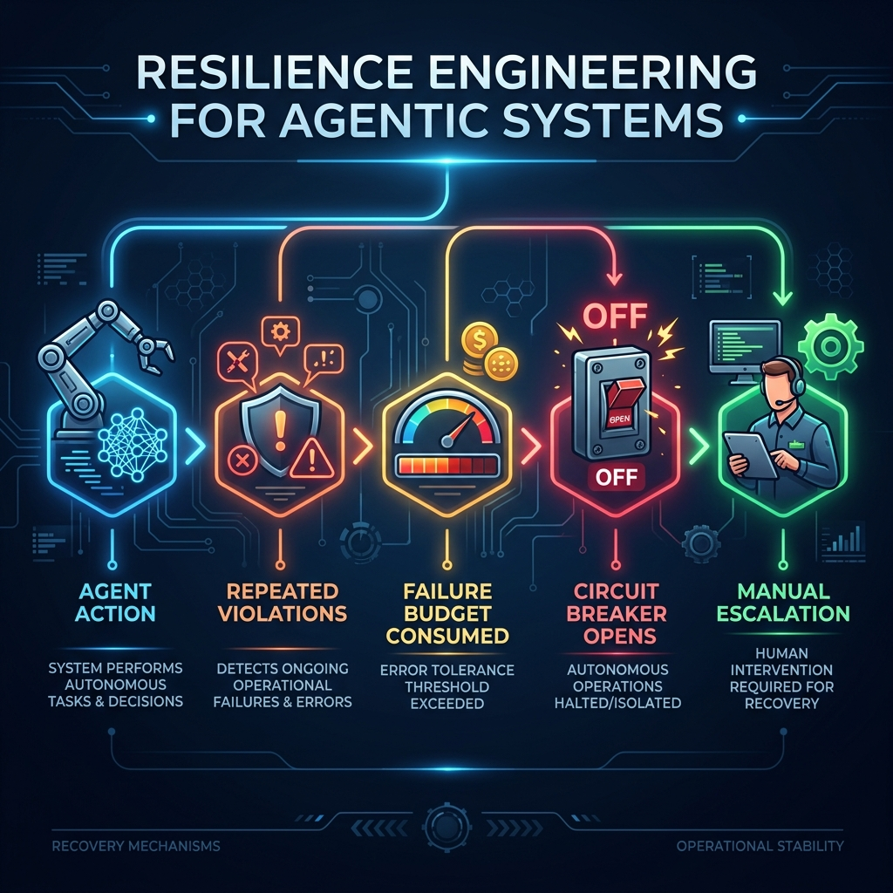
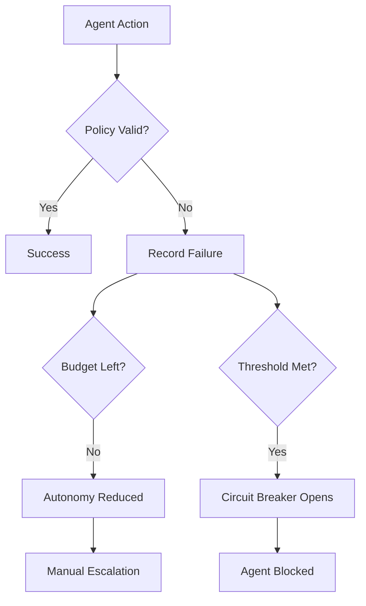

# Resilience Engineering for Agentic Systems 🛡️



Designing systems that maintain safety and stability even under continuous failure conditions.

---

## 🚀 Why This Module Exists

In production agentic systems, failure is not an edge case—it is a constant. Network timeouts, model hallucinations, and unexpected tool outputs can lead to catastrophic cascades if not properly contained.

This module demonstrates how to apply **SRE (Site Reliability Engineering)** principles to AI agents, ensuring that autonomy is bounded by safety kill-switches and failure budgets.

### Key Objectives
- **Failure Containment**: Preventing a single agent failure from impacting the entire system.
- **Circuit Breaking**: Automatically halting agent operations when error thresholds are met.
- **Failure Budgeting**: Managing the acceptable level of risk and error tolerance.
- **Graceful Degradation**: Reducing autonomy levels (e.g., switching from full-auto to human-in-the-loop) during instability.

---

## 🧠 Core Principles

> Every agent needs a kill switch.

Reliable autonomy is **bounded autonomy**. Systems must be designed for recovery, not just for perfect execution.

---

## ⚙️ How the Demo Works

The `simulator.py` script triggers a series of high-risk actions that intentionally violate safety policies. This activates the resilience mechanisms:

1. **Failure Budget Consumption**: Each violation consumes a portion of the allowed error threshold.
2. **Autonomy Reduction**: Once the budget is exceeded, the agent's autonomy is reduced, triggering manual escalation.
3. **Circuit Breaker Activation**: After repeated failures, the circuit breaker opens, blocking all further agent actions until a manual reset is performed.

---

## 🔄 Resilience Flow



---

## 📂 Module Structure

- [**circuit_breaker.py**](circuit_breaker.py) — Logic for halting operations after repeated failures.
- [**failure_budget.py**](failure_budget.py) — Management of error tolerance thresholds.
- [**demo_resilience_agent.py**](demo_resilience_agent.py) — Agent implementation with integrated safety mechanisms.
- [**simulator.py**](simulator.py) — Test scenarios for stress-testing agent resilience.

---

## ▶️ Run the Demo

Stress-test the resilience mechanisms:

```bash
python simulator.py
```

### 🧪 Expected Output
```text
--- RESILIENCE TEST ---
[EXECUTE] {'type': 'payment', 'risk': 'high'}
[VIOLATION] High-risk action detected
[FAILURE COUNT] 1
[CONTAINMENT] Action paused
...
[CIRCUIT BREAKER OPENED] Agent access blocked
[FAILURE BUDGET EXCEEDED] Reduce autonomy level
[ESCALATION] Manual review required
[BLOCKED] Circuit breaker is open
```

---

## 📊 Engineering Patterns Used

- **Circuit Breaker**: Preventing repeated failure loops.
- **Failure Budgeting**: Quantifying and managing operational risk.
- **Autonomy Degradation**: Shifting from autonomous to manual control during crises.
- **Escalation Triggers**: Automated alerts for human intervention.

---

*This module is part of the **Agentic System Failure Playbook**. For foundaton on failure detection, see [failure_taxonomy](../failure_taxonomy/). For state recovery, see [reversible_autonomy](../reversible_autonomy/). For observability, see [decision_traceability](../decision_traceability/).*