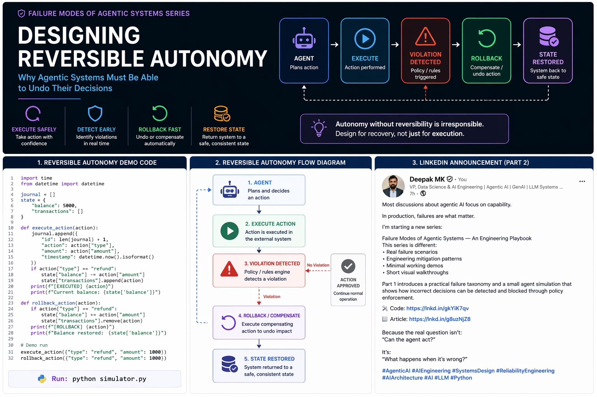
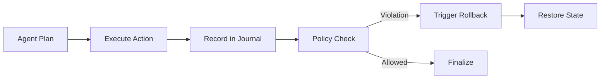

# Reversible Autonomy 🔄



Designing agentic systems that can safely undo their decisions and actions.

---

## 🚀 Why This Module Exists

In complex agentic systems, detecting failure is only the first step. By the time a policy violation or reasoning drift is detected, the agent may have already mutated system state or triggered external actions.

This module demonstrates the engineering patterns required to build **responsible autonomy**, where every action is trackable and, most importantly, **reversible**.

### Key Objectives
- **Safe Execution**: Implementing multi-stage execution and validation.
- **Violation Detection**: Identifying deviations from safety policies post-execution.
- **State Restoration**: Using compensating transactions and rollbacks to restore system consistency.
- **Auditability**: Maintaining a high-fidelity journal of all autonomous decisions.

---

## 🧠 Core Principle

> Autonomy without reversibility is irresponsible.

Every autonomous action should be designed with a corresponding **compensating action**. If an agent can "do" something, it must be able to "undo" it, or at least contain the Blast Radius of its failure.

---

## ⚙️ How the Demo Works

This module simulates a financial agent capable of processing refunds. It demonstrates what happens when an agent executes a plan that is later found to violate a safety policy (e.g., an approval threshold).

### Components
- **Action Journal**: A ledger that tracks every attempted and executed action.
- **Policy Engine**: A secondary validator that checks actions against safety boundaries.
- **Rollback Logic**: The specific code paths responsible for reversing mutated state.

---

## 🔄 Execution Flow



---

## 📂 Module Structure

- [**demo_reversible_agent.py**](demo_reversible_agent.py) — Core agent logic demonstrating the "Do-Check-Undo" pattern.
- [**actions.py**](actions.py) — Definitions for atomic execution and rollback functions.
- [**policy_engine.py**](policy_engine.py) — The safety rules defining what is allowed.
- [**journal.py**](journal.py) — The stateful log of all agent activities.
- [**simulator.py**](simulator.py) — Test scenarios to trigger both safe and risky behaviors.

---

## ▶️ Run the Demo

Execute the simulator to see the rollback mechanism in action:

```bash
python simulator.py
```

### 🧪 Expected Output: Risky Action
```text
--- RISKY ACTION ---
[AGENT RECEIVED] {'type': 'refund', 'amount': 1000}
[EXECUTE] {'type': 'refund', 'amount': 1000}
[VIOLATION] Refund exceeds approval limit
[ROLLBACK] {'type': 'refund', 'amount': 1000}
[FINAL STATE] {'balance': 5000, 'transactions': []}
```

---

## 📊 Engineering Patterns Used

- **Action Journal**: Maintains a history of intent and result for every action.
- **Idempotent Execution**: Ensures that re-running or reversing actions doesn't cause side effects.
- **Compensating Actions**: Logic designed to logically undo a previous action (e.g., a "re-credit" for a "refund").
- **Post-Action Policy Enforcement**: Validating the actual result of an action against intent.

---

## ⚠️ Limitations & Considerations

This is a minimal simulation designed for educational purposes. In production systems, you would extend these patterns with:
- **Distributed Transactions**: Ensuring consistency across multiple services.
- **Event Sourcing**: Using logs as the primary source of truth.
- **Persistent Audit Trails**: Multi-region, immutable logs for compliance.
- **Orchestration**: Managing complex, multi-step rollbacks using workflows (e.g., Temporal or Inngest).

---

*This module is part of the **Agentic System Failure Playbook**. For foundational concepts, see the [failure_taxonomy](../failure_taxonomy/) module.*